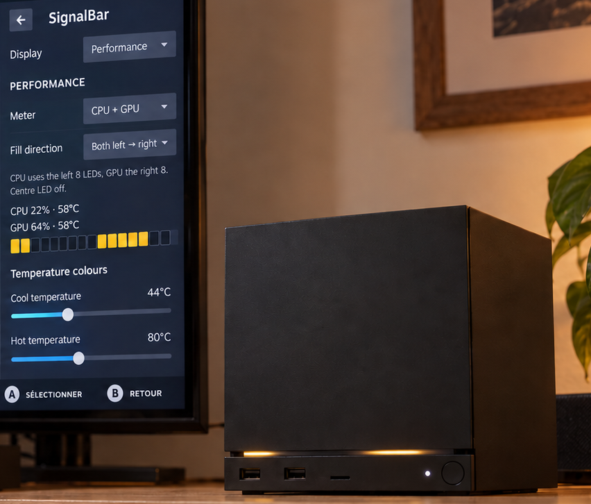

# SignalBar

**Smart status lighting for Steam Machine**

SignalBar turns the official Steam Machine's 17-pixel light bar into a compact
system display. It is deliberately Valve-first: when Steam or another process
changes the LEDs, SignalBar yields, waits through a cooldown and a stable
period, then considers resuming.

### Artwork mode


The sampled 17-colour row is previewed in Decky and reproduced across the
machine's thin diffused light bar.

### Performance mode



The mixed meter dedicates eight LEDs to CPU load, one dark centre separator,
and eight LEDs to GPU load. The physical diffuser softens individual emitters;
the Decky preview keeps the 17 logical cells visible.

### Playtime Countdown

An active Steam Families limit takes priority while a game is running; an
optional personal timer provides the same signal without parental controls.
Both temporarily replace Artwork or Performance. The bar empties from right to
left, turns amber and then red as time runs out, and repeats three brief white
flashes during the final eight seconds before automatically returning to the
selected display.

*Interface visualisations reflect the implemented controls; exact
SteamOS rendering can vary by Decky/Steam version.*

## v0.3.0 — hardware-tested release

v0.3.0 is the first release to make SignalBar a persistent background signal
system rather than a panel-driven effect. The complete upgrade path from
v0.2.1 has been tested on the official Steam Machine hardware: SignalBar starts
with Decky, follows game launches and exits, restores the selected base mode,
and displays Steam Families or personal countdowns without requiring the
settings panel to be opened first.

### What's new since v0.2.1

- Background activation at Decky plugin load: current-game detection, Artwork
  sampling, Performance, Steam Families, downloads and suspend/resume handling
  work without first opening SignalBar's settings panel.
- Strict arbitration keeps ownership predictable: Valve/system activity first,
  then an explicit Preview, Steam Families, the personal timer, and finally the
  selected Artwork or Performance mode. Disabled always returns control to
  Valve.
- Game exit, AppID changes, parental-display disable and resume from suspend
  clear stale game/countdown state immediately. Artwork from the previous game
  can no longer remain active after that game closes.
- Explicit Artwork, Performance and Disabled modes. Artwork and Performance
  are alternatives and never overwrite or blend with each other.
- Local Steam Library Hero, Header or Capsule sampling: six automatic candidate
  rows, Centre, Lower, or a manual vertical position; exactly 17
  left-to-right RGB pixels. The Decky panel shows the game title rather than
  an internal cache filename.
- Artwork source and row choices are persisted per AppID. A new game starts
  from the default; changing either setting creates that game's own profile.
- CPU, GPU and mixed meters. Mixed uses 8 LEDs for CPU, one black separator,
  and 8 LEDs for GPU. Its halves can both grow left-to-right or mirror from
  the outside edges toward the centre. Lit length represents load and colour
  represents temperature.
- Three named temperature palettes with explicit Cool and Hot temperature
  thresholds. Colours blend continuously between those thresholds.
- Physical LED order is reversed by default to match the official Steam
  Machine while every software preview remains visually left-to-right.
- Steam Families remaining-time countdown and a free 5–240 minute personal
  timer. Steam Families has strict priority over the personal timer and the
  selected Artwork or Performance display while a game is running. The bar
  shrinks from the right with a configurable 0–6-pixel optical compensation
  for the physical diffuser and carries a right-to-left highlight. Debug shows
  the logical-to-physical mapping; the default compensation is three.
- Below 15 minutes the countdown turns amber; below five minutes it becomes
  pure red and keeps only the right-to-left circulation. During the final eight
  seconds, three brief full-white flashes repeat until zero, before the base
  display returns immediately.
- Five selectable starting colours and a 15-second countdown preview that
  includes the final alert; testing never cancels a real timer.
- Selectable full-bar scale: start full from the timer's initial duration, or
  make 17 LEDs represent the final 1, 2, 3 or 4 hours.
- The Debug section now reports game-detection source, backend synchronization,
  Steam Families callback latency, last LED-write age, external-change age and
  the guard's cooldown/stability state. Its optical compensation slider affects
  countdowns only.
- Userspace Vanilla Guard, redundant-frame suppression, serialized sysfs writes
  and a minimum 50 ms hardware-write interval.
- No telemetry, cloud service, network call, SteamOS read-only modification, or
  shell command at runtime.

## Install

1. Install Decky Loader and enable Developer Mode.
2. In Decky settings, choose **Developer → Install Plugin from ZIP** and select
   `SignalBar-v0.3.0.zip`.
3. Restart Decky Loader if the panel does not appear immediately.

Manual installation is also possible by extracting the ZIP into
`~/homebrew/plugins/`, leaving a `SignalBar/` directory, then restarting
`plugin_loader`.

SignalBar requests Decky's root flag solely because the kernel's
`/sys/class/leds/valve-leds[*]/multi_intensity` files require it.

## Uninstall

Use Decky's plugin settings to uninstall SignalBar. The backend stops writing
and only restores its startup frame if the current hardware state still matches
SignalBar's own last verified write. It never restores over a detected external
change. Settings live in Decky's normal plugin settings directory and may be
removed separately if desired.

## Build and test

```bash
npm install
npm test
npm run build
npm run package
```

The release archive is written to `out/SignalBar-v0.3.0.zip`.

## Display modes and performance

Performance and Artwork are alternative full-bar providers; they are not
overlaid. Select **Artwork** to display the current game's sampled image, or
**Performance** for the selected CPU, GPU or mixed meter. **Disabled** returns
control to Valve. Configurations saved by v0.2's former Automatic mode migrate
to Performance when its performance priority was enabled, otherwise Artwork.

Steam defines four Library asset roles. SignalBar offers the three complete
image formats that are useful for colour sampling: **Library Hero** (wide
background), **Library Header** and **Library Capsule** (vertical). Library
Logo is deliberately excluded because it is a transparent foreground overlay
intended to sit over the Hero rather than a complete game image.

`Cool temperature` is the point where the selected palette starts. `Hot
temperature` is the point where it reaches its final hot colour. Between them,
SignalBar blends continuously; below/above them it clamps to the endpoint
colour. These controls are temperature thresholds, not colour pickers—the
separate `Temperature colours` menu chooses the palette.

## Playtime countdowns

SignalBar listens locally for SteamUI's Steam Families remaining-playtime
callback. When a restriction is active, the first observed remaining value
becomes the visual full scale in `Timer duration` mode; fixed scales instead use
their selected 1–4 hour window. The bar subsequently empties toward the left.
Values over 24 hours are treated like SteamUI's no-active-limit sentinel.
The setting can be disabled independently without affecting a personal timer.
Disabling it, closing the game or switching games immediately clears the
parental countdown and its final alert; a new game must provide a fresh Steam
Families value.

The free timer uses active elapsed time and keeps running when the Decky panel is
closed. Steam Families is shown only while a game is running and has priority
over a simultaneous free timer. The selected starting colour turns amber below
15 minutes, then pure red below five minutes while the circulation continues at
constant brightness. During the final eight seconds, three brief white flashes
repeat until zero. The 15-second Preview demonstrates the countdown and final
alert without cancelling either real timer. All countdowns remain
below Valve/system ownership and are suppressed when Display is Disabled.

The Debug setting **Extra dark LEDs** calibrates physical diffuser bloom without
changing the logical Decky preview. For example, when the preview contains 12
lit cells, a compensation of 2 writes 10 lit LEDs to the hardware. It accepts
0–6, defaults to 3, leaves a completely full 17-LED bar intact, and keeps one
physical LED visible while time remains. This calibration is exclusive to
countdown frames and never alters Artwork or Performance.

**Full bar scale** controls time mapping. `Timer duration` starts every real
timer at 17 LEDs. Fixed 1/2/3/4-hour scales make 17 LEDs represent that remaining
window; a longer limit stays full until it enters the window. The 15-second
Preview always uses its own complete scale so the animation remains testable.

Debug is the final panel section. It reports human-readable age since the last
LED write and external change, separate guard cooldown and stability timers,
the game detection source, backend synchronization latency, and whether Steam
Families is idle, disabled, waiting, or received after a measured delay.

## Known limits

- Vanilla Guard is a conservative userspace observer, not a Valve protocol or
  kernel ownership lock. It can detect a changed sysfs state only after that
  change becomes visible. The Decky frontend additionally leases ownership to
  Steam on native download callbacks, but that private SteamClient hook may
  vary between Steam builds.
- A Valve animation that repeatedly writes the same observable value cannot be
  distinguished from a stable LED state. SignalBar therefore also requires a
  startup settle, cooldown, and stable window before resuming.
- GPU discovery targets DRM `gpu_busy_percent` and device hwmon. CPU load comes
  from `/proc/stat`; CPU temperature prefers k10temp/coretemp/zenpower hwmon and
  then thermal zones. A missing selected metric is shown as unavailable; switch
  to Artwork explicitly if a performance sensor is not available.
- v0.2's physical reversal is based on the supplied official-hardware photo and
  user test. The Debug panel exposes an override for diagnosis.
- The main v0.3.0 lifecycle, per-game Artwork persistence, Performance display,
  Steam Families countdown and final alert have been tested on the official
  Steam Machine. Private SteamClient callbacks and available CPU/GPU sensor
  paths can still vary with future SteamOS or Decky builds.
- v0.3.0 intentionally has no Internet artwork fallback, audio/VU, network,
  FPS, Moonlight/Sunshine, controller, or storage providers.

See [ARCHITECTURE.md](ARCHITECTURE.md) for design details.
