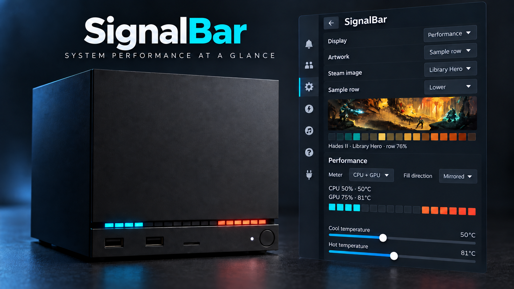

# SignalBar

**Smart status lighting for Steam Machine**

SignalBar turns the official Steam Machine's 17-pixel light bar into a compact
system display. It is deliberately Valve-first: when Steam or another process
changes the LEDs, SignalBar yields, waits through a cooldown and a stable
period, then considers resuming.



*Promotional concept based on the implemented v0.2.1 interface and official
hardware reference; exact SteamOS rendering can vary by Decky/Steam version.*

## v0.2.1 features

- Explicit Artwork, Performance and Disabled modes. Artwork and Performance
  are alternatives and never overwrite or blend with each other.
- Local Steam Library Hero, Header or Capsule sampling: six automatic candidate
  rows, Centre, Lower, or a manual vertical position; exactly 17
  left-to-right RGB pixels. The Decky panel shows the game title rather than
  an internal cache filename.
- Artwork source and row choices are persisted per AppID. A new game starts
  from the default; changing either setting creates that game's own profile.
- CPU, GPU and mixed meters. Mixed uses 8 LEDs for CPU, one black separator,
  and 8 LEDs for GPU. Its halves can both grow left-to-right or mirror from
  the outside edges toward the centre. Lit length represents load and colour
  represents temperature.
- Three named temperature palettes with explicit Cool and Hot temperature
  thresholds. Colours blend continuously between those thresholds.
- Physical LED order is reversed by default to match the official Steam
  Machine while every software preview remains visually left-to-right.
- Userspace Vanilla Guard, redundant-frame suppression, serialized sysfs writes
  and a minimum 50 ms hardware-write interval.
- No telemetry, cloud service, network call, SteamOS read-only modification, or
  shell command at runtime.

## Install

1. Install Decky Loader and enable Developer Mode.
2. In Decky settings, choose **Developer → Install Plugin from ZIP** and select
   `SignalBar-v0.2.1.zip`.
3. Restart Decky Loader if the panel does not appear immediately.

Manual installation is also possible by extracting the ZIP into
`~/homebrew/plugins/`, leaving a `SignalBar/` directory, then restarting
`plugin_loader`.

SignalBar requests Decky's root flag solely because the kernel's
`/sys/class/leds/valve-leds[*]/multi_intensity` files require it.

## Uninstall

Use Decky's plugin settings to uninstall SignalBar. The backend stops writing
and only restores its startup frame if the current hardware state still matches
SignalBar's own last verified write. It never restores over a detected external
change. Settings live in Decky's normal plugin settings directory and may be
removed separately if desired.

## Build and test

```bash
npm install
npm test
npm run build
npm run package
```

The release archive is written to `out/SignalBar-v0.2.1.zip`.

## Automated GitHub releases

The workflow in `.github/workflows/release.yml` runs the type-check, backend
and frontend tests, build, packaging and ZIP integrity check on `main`, pull
requests and release tags. Pushing a tag that exactly matches the package
version automatically creates a GitHub Release with the installable ZIP and
its SHA-256 checksum:

```bash
git tag v0.2.1
git push origin v0.2.1
```

No personal access token is required: the release job uses GitHub's scoped
workflow token with write access limited to repository contents.

## Display modes and performance

Performance and Artwork are alternative full-bar providers; they are not
overlaid. Select **Artwork** to display the current game's sampled image, or
**Performance** for the selected CPU, GPU or mixed meter. **Disabled** returns
control to Valve. Configurations saved by v0.2's former Automatic mode migrate
to Performance when its performance priority was enabled, otherwise Artwork.

Steam defines four Library asset roles. SignalBar offers the three complete
image formats that are useful for colour sampling: **Library Hero** (wide
background), **Library Header** and **Library Capsule** (vertical). Library
Logo is deliberately excluded because it is a transparent foreground overlay
intended to sit over the Hero rather than a complete game image.

`Cool temperature` is the point where the selected palette starts. `Hot
temperature` is the point where it reaches its final hot colour. Between them,
SignalBar blends continuously; below/above them it clamps to the endpoint
colour. These controls are temperature thresholds, not colour pickers—the
separate `Temperature colours` menu chooses the palette.

## Known limits

- Vanilla Guard is a conservative userspace observer, not a Valve protocol or
  kernel ownership lock. It can detect a changed sysfs state only after that
  change becomes visible. The Decky frontend additionally leases ownership to
  Steam on native download callbacks, but that private SteamClient hook may
  vary between Steam builds.
- A Valve animation that repeatedly writes the same observable value cannot be
  distinguished from a stable LED state. SignalBar therefore also requires a
  startup settle, cooldown, and stable window before resuming.
- GPU discovery targets DRM `gpu_busy_percent` and device hwmon. CPU load comes
  from `/proc/stat`; CPU temperature prefers k10temp/coretemp/zenpower hwmon and
  then thermal zones. A missing selected metric is shown as unavailable; switch
  to Artwork explicitly if a performance sensor is not available.
- v0.2's physical reversal is based on the supplied official-hardware photo and
  user test. The Debug panel exposes an override for diagnosis.
- Final proof of the new CPU sensors, per-game switching and controller
  navigation still requires a fresh on-device v0.2.1 test.
- v0.2.1 intentionally has no decorative animations, Internet artwork fallback,
  audio/VU, network, FPS, Moonlight/Sunshine, controller, or storage providers.

See [ARCHITECTURE.md](ARCHITECTURE.md) for design details.
