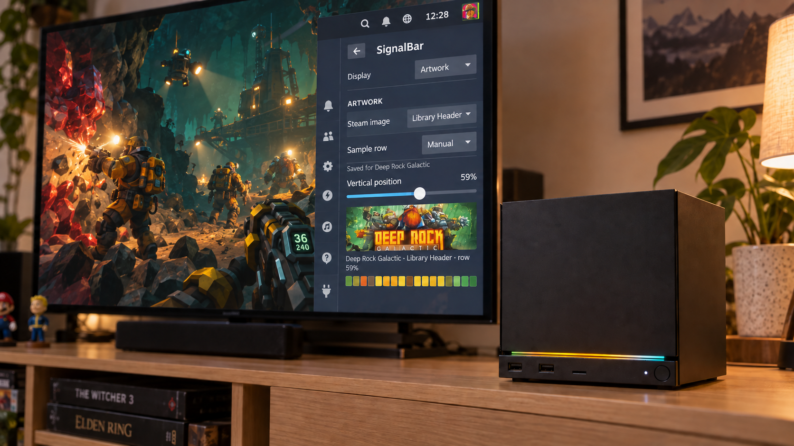
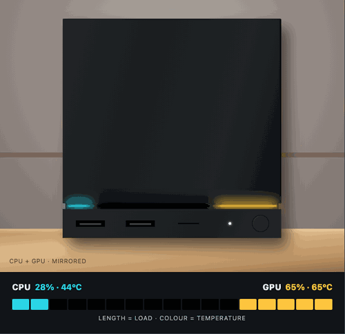
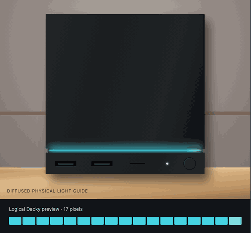
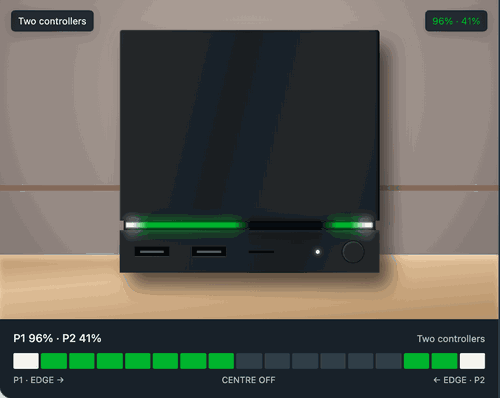
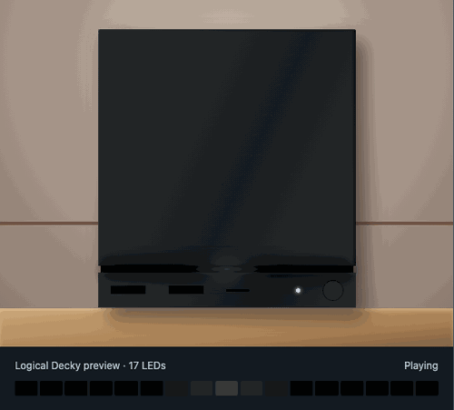
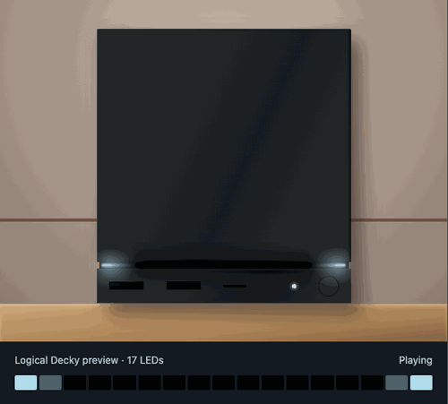
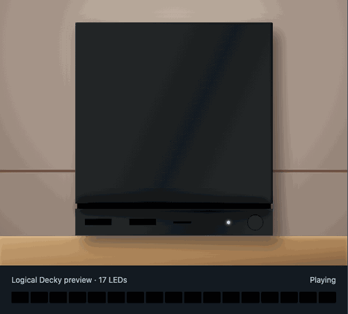
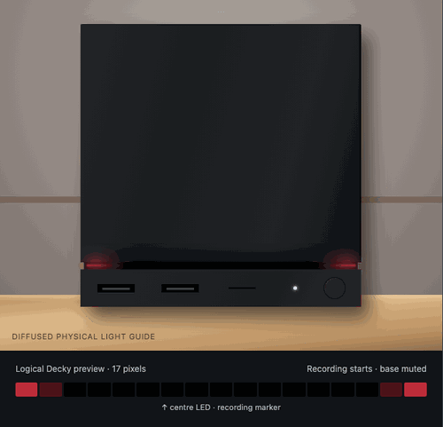

# SignalBar

**Smart status lighting for the official Steam Machine**

Make your Steam Machine's 17-pixel light bar useful and a little more
expressive. Choose a persistent display, then let playtime warnings and short
Steam moments take the stage before your display returns.

[Download SignalBar v0.5.0 beta 2](https://github.com/Albusquerque/SignalBar/releases/download/v0.5.0-beta.2/SignalBar-v0.5.0-beta.2.zip)

This is a beta. The [stable v0.4.0 release](https://github.com/Albusquerque/SignalBar/releases/tag/v0.4.0)
remains available while controller telemetry is tested on real Steam Machine
hardware and different controllers.

## Your everyday display

### Artwork

Carry the current game's colours onto the light bar. Choose Library Hero,
Header, or Capsule artwork and select the best row automatically or manually.
The choice is remembered separately for every game.

Local custom artwork is preferred, including SteamGridDB replacements and
images assigned to non-Steam shortcuts. In Artwork mode, the quick Decky panel
shows the active game image directly above its exact 17-colour sample.



### Performance

Use the bar for CPU, GPU, or both. Mixed mode gives each signal eight LEDs,
with the centre LED off. Length shows load and colour shows temperature.
Responsive, Balanced, and Smooth profiles control how quickly the meter reacts.

Performance can be limited to game sessions or kept active on the Steam home
screen. Three ready-made temperature palettes are included, and a native Decky
colour picker lets you choose custom Cool, Middle, and Hot colours.



### Playtime Countdown

See the time you have left. An active Steam Families limit automatically takes
priority when a game starts, or you can start a personal timer. The bar empties
from right to left, turns amber below 15 minutes, and turns red below five.
During the final eight seconds, three short white flashes repeat until zero.



### Controller battery (0.5.0 beta)

Get a short welcome when a controller connects and a warning when its battery
runs low. Charging can have its own brief signal. When a second controller
connects, the bar can show both players; a permanent two-controller gauge uses
eight LEDs per player with the centre LED off. There are three visual styles
for each of these situations and for the single-controller gauge.

The permanent gauge is optional: **Off**, **On Home**, or **Everywhere**. Brief
alerts are a separate choice: **Off**, **On Home**, **In game**, or **Home + in
game**. By default, the permanent gauge is off while alerts are allowed in both
places. An alert briefly replaces the current display, then the live Artwork,
Performance, or countdown frame returns. Low-battery alerts fire on a threshold
crossing, not on every battery reading. The final five minutes of a countdown
remain protected.



Battery data comes from Steam's controller callbacks. A controller that reports
only a coarse battery level is labelled as such; SignalBar never invents an
exact percentage. If there is no usable battery data, the gauge stays off.
Controller support and callback payloads still need verification on physical
hardware in this beta.

## Light events

Light events briefly replace the current display, play their animation, then
restore the live Artwork or Performance state. They can work outside a game.
Each category has its own switch, animation selector, and nearby live preview.

### Notification

A cyan call travels across the whole strip and echoes back into quiet.



### Screenshot

An icy shutter closes, followed by two flashes with expanding echoes.



### Achievement

A constellation appears, connects in both directions, and celebrates with two
full-bar bursts.



### Recording

Two red traces mark recording start and stop. While recording, the centre LED
stays pure red over Artwork or Performance. Its two neighbours are black by
default to keep the marker distinct through the physical diffuser. The marker
never modifies a playtime countdown or another event animation.



## How priorities work

SignalBar follows a strict order:

1. Disabled returns complete control to Steam.
2. A new native LED write interrupts SignalBar and is never overwritten by a
   stale frame.
3. The final five minutes of a countdown are protected from light events.
4. Short light events and manual previews temporarily replace non-critical
   displays.
5. Low-battery alerts can interrupt other short events; connection and charging
   alerts do not interrupt an active Steam light event.
6. Steam Families and personal countdowns replace the selected base display.
7. The optional controller gauge replaces the base display in its selected
   context; otherwise Artwork or Performance provides it.

## Install

### Decky Loader

1. Install [Decky Loader](https://decky.xyz/) and enable Developer Mode.
2. Download `SignalBar-v0.5.0-beta.2.zip` from the prerelease. Do not extract it.
3. Open **Decky Settings > Developer > Install Plugin from ZIP**.
4. Select the downloaded archive.
5. Restart Decky Loader if SignalBar does not appear immediately.

### Manual installation

Extract the archive into `~/homebrew/plugins/` so the result is a
`~/homebrew/plugins/SignalBar/` directory, then restart `plugin_loader`.

SignalBar requests Decky's root flag only because the Steam Machine exposes its
light bar through root-owned `valve-leds` sysfs files.

## First setup

1. Open SignalBar in Decky's quick-access menu.
2. Choose **Artwork**, **Performance**, or **Disabled**.
3. Open **Detailed settings** for Artwork, Performance, Playtime, Light events,
   Controllers, and Advanced options.
4. Use Preview to try each animation before enabling live light events.

Live Light events are disabled by default.
Controller alerts have their own switch and work independently of Light events.

## Configuration

### Artwork

- Library Hero, Header, or vertical Capsule
- Automatic, centre, lower, or manual sample row
- Red line over the image showing the selected manual row
- Saved source and position for each game
- Local SteamGridDB and non-Steam custom artwork support

Steam's Library Logo is not sampled because it is a transparent foreground
layer rather than a complete image.

### Performance

- CPU, GPU, or mixed CPU + GPU
- Both meters left to right, or mirrored toward the centre
- Responsive, Balanced, or Smooth filtering
- Optional always-on display outside games
- Three built-in temperature palettes
- Custom Cool, Middle, and Hot colours through Decky's colour picker
- Live CPU/GPU load and temperature in the quick panel

`Cool temperature` and `Hot temperature` are thresholds. The selected colour
palette is blended continuously between them.

### Playtime

- Automatic Steam Families remaining-time signal
- Personal timer from five to 240 minutes
- Five starting colours
- Timer-duration scale or fixed one, two, three, or four-hour full bar
- Final eight-second alert

Steam Families only appears while a game is running. Closing or switching games
clears the old parental countdown immediately.

### Controllers

- Permanent battery gauge: Off, On Home, or Everywhere
- Brief alert contexts: Off, On Home, In game, or Home + in game
- Connection, low-battery, and charging alerts can each be disabled
- Adjustable low-battery threshold from 5% to 30%
- Three selectable styles for each signal, including the two-controller view
- Local preview buttons work without a connected controller or live alerts

The gauge takes the place of Artwork or Performance where selected; it does
not combine their colours. A Steam Families countdown still wins. Unknown or
coarse battery data is not displayed as an exact percentage.

### Optical calibration

The physical diffuser can make a lit LED bleed into a neighbouring dark space.
**Extra dark LEDs** compensates by lighting fewer physical pixels than the
logical preview. It affects Countdown and Performance, never Artwork. The
default is two.

The official Steam Machine's physical LED order is reversed by default while
the Decky preview remains left to right.

## Safety and privacy

- No telemetry, cloud service, account login, or runtime network request
- No SteamOS read-only filesystem modification
- Local read-only discovery of Steam and custom-grid artwork
- Serialized and rate-limited hardware writes
- Redundant-frame suppression to reduce unnecessary LED writes
- A userspace guard that yields when Steam or another process changes the bar

SignalBar only restores a previous frame when the hardware still matches its
own last verified write.

## Requirements and known limits

- Designed for the official Steam Machine 17-pixel `valve-leds` light bar
- Requires Decky Loader on SteamOS
- CPU and GPU sensors depend on paths exposed by the hardware and SteamOS build
- Steam notifications and recording use private SteamClient callbacks that may
  change between Steam builds
- Achievement animations follow Steam's achievement notification
- Screenshot animations follow a newly written screenshot file
- Controller battery reporting relies on private SteamClient callbacks and
  varies by controller. This beta has automated coverage but not yet a verified
  compatibility list for real Steam Machine hardware.
- No Internet artwork fallback, audio visualizer, FPS, network, storage,
  Moonlight, or Sunshine provider yet

## Build and test

```bash
npm install
npm test
npm run build
npm run package
```

The installable archive is written to `out/SignalBar-v0.5.0-beta.2.zip`.

See [ARCHITECTURE.md](ARCHITECTURE.md) for provider, arbitration, guard, and
hardware-rendering details. Release history is available in
[CHANGELOG.md](CHANGELOG.md).

## Uninstall and license

Use Decky's plugin settings to uninstall SignalBar. Settings remain in Decky's
normal plugin settings directory and can be removed separately if desired.

SignalBar is released under the [BSD 3-Clause License](LICENSE).
